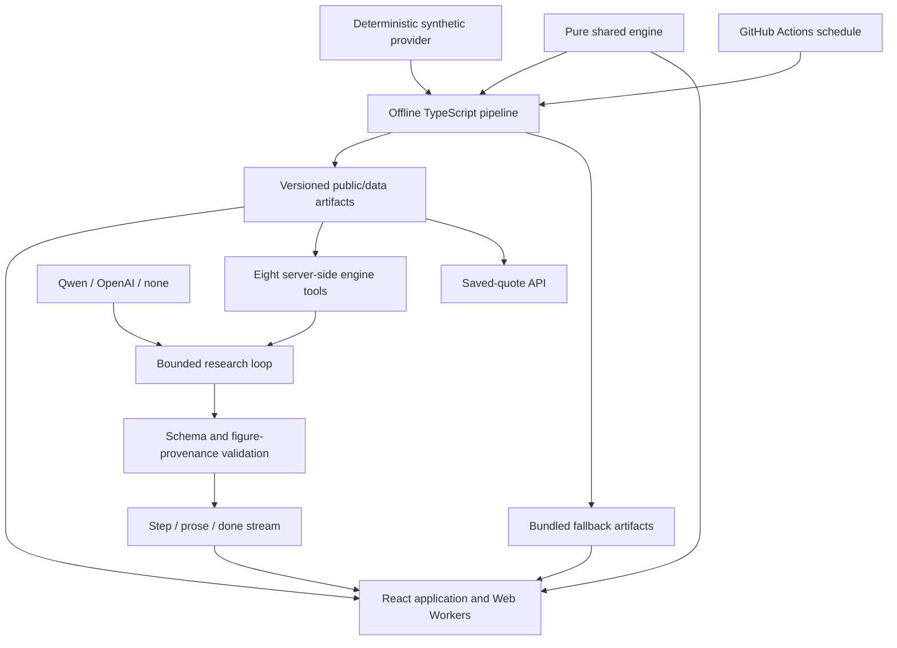

<div align="center">
  
  <h1>Kairos</h1>
  <p><strong>Research for the hours Wall Street is closed.</strong></p>
  <p>Explain the move. Estimate the opening gap. Keep the record.<br />An auditable research desk for around-the-clock tokenized US equities.</p>
  <p><a href="#quick-start">Quick start</a> · <a href="#deployment">Deployment</a> · <a href="#architecture">Architecture</a> · <a href="#api-reference">API reference</a> · <a href="LICENSE">MIT license</a></p>
  <p>
    
    
    
    <br />
    
    
    
  </p>
</div>

---

Kairos studies the gap between a tokenized stock’s traded price and what observable market, sector and news information can explain while the underlying exchange is closed. It publishes an uncertainty band, estimates the next opening gap, and scores saved forecasts against the opening print.

**Current data is simulated.** Quotes, headlines, history and both ledgers come from a deterministic synthetic provider. The forward ledger’s `live` origin means a forecast was logged prospectively; it does not mean its prices came from a real exchange. Bitget integration is not enabled. Qwen and OpenAI are optional language providers, never the source of displayed market figures.

## The product

| Surface | Purpose |
| --- | --- |
| **Markets** `/` | Compare eighteen equity tokens by drift, liquidity support and explained movement. Two index tokens provide market factors. |
| **Instrument** `/instrument/rNVDA` | Inspect reckoning history, attribution, news, opening-gap forecasts and historical analogs. |
| **The Record** `/record` | Audit separate backtest and forward ledgers, calibration, coverage, skill and JSON exports. |
| **Ask Kairos** `/ask` | Run bounded research through eight engine tools, with streamed progress and validated figures. Works without a model key. |
| **Method** `/method` | Open the field-guide modal and its ten-section methodology: equations, assumptions, limitations and falsification criteria. |

There are no accounts, wallets or order-placement endpoints. Kairos is analysis, not advice.

## Quick start

Requires **Node.js 22 or later** and npm.

```sh
npm ci
npm run dev
```

Open the URL printed by Vite. The development server includes the research and saved-quote API handlers. No key is needed: deterministic templates cover single-name analysis, comparison, scanning, holding risk and model reliability.

For optional model-written research, create **`.env.local`** beside `package.json`:

```dotenv
VITE_DATA_SOURCE=synthetic
OPENAI_API_KEY=your-local-secret
OPENAI_MODEL=gpt-4o-mini
```

Restart the server after changing variables. `.env`, `.env.local`, other environment files and `.vercel/` are ignored by Git. Only the blank [`.env.example`](.env.example) belongs in source control. On PowerShell with script execution disabled, use `npm.cmd` instead of `npm`.

```sh
npm test
npm run typecheck
npm run build
npm run preview
```

`preview` serves the static production bundle, not Vercel functions. Ask falls back to saved-data research when its API is unavailable. Fonts, company marks and globe textures are self-hosted. Once dependencies and application assets are available locally, external services are optional.

## Deployment

### Vercel settings

1. Import this repository and choose the **Vite** framework preset.
2. Keep the root at the repository root. Build command: **`npm run build`**. Output: **`dist`**. Function runtime: **Node.js 22.x**.
3. Add the variables below **before deploying**. Do not upload or commit your local `.env` file.
4. Deploy. [`vercel.json`](vercel.json) provides route rewrites and bundles the saved artifacts needed by the functions.
5. **Redeploy after changing environment variables**; an existing deployment does not pick up new values.

### The OpenAI secret

In **Vercel → project → Settings → Environment Variables**, create `OPENAI_API_KEY`, paste your local key, select **Production**, and enable **Sensitive**. Select **Preview** too only if those deployments should make paid requests. Vercel injects the key into the server environment; `api/_llm.ts` reads `process.env.OPENAI_API_KEY`.

**Never call it `VITE_OPENAI_API_KEY`.** Vite-prefixed variables are public browser configuration. The browser calls `/api/ask`; it never receives the secret or calls the provider directly.

| Variable | Initial value | Purpose |
| --- | --- | --- |
| `VITE_DATA_SOURCE` | `synthetic` | Public. Keep until real-market integration is implemented. |
| `VITE_DATA_BASE` | Leave unset | Public. Uses same-origin `/data/`. |
| `OPENAI_API_KEY` | Your key, entered in Vercel | **Secret.** Temporary provider while Qwen approval is pending. |
| `OPENAI_MODEL` | `gpt-4o-mini` | Server-only model selection. |
| `QWEN_API_KEY` | Leave unset until approved | **Secret.** Takes priority over OpenAI when present. |
| `QWEN_BASE_URL` | `https://hackathon.bitgetops.com/v1` | Server-only; this is also the code default. |
| `QWEN_MODEL` | `qwen3.8-max` | Server-only; this is also the code default. |
| `QWEN_DAILY_TOKEN_BUDGET` | `30000` | Token guard shared by both providers despite its historical name. `0` pauses language calls. |
| `BITGET_MCP_URL`, `AGENTKEY_API_KEY` | Leave unset | Reserved integrations, unused in this release. |

Selection is **Qwen → OpenAI → deterministic templates**, based on configured keys. Failure of the selected provider returns templates instead of silently charging another provider. Research is capped at six tool calls, forty-five seconds and twenty requests per IP per hour. Rate and token counters are in-memory per warm function instance, **not a durable account-wide spending limit**. Set spending controls in the provider account before sharing a public demo.

The token guard reserves estimated prompt tokens plus the maximum response, then replaces the estimate with provider-reported usage (including overages). Calls without a usage report retain their reservation. Estimation can differ from tokenization; this is a soft application limit. A budget-paused message refers to this guard, not the provider account's credit balance.

Official guidance: [Vercel environment variables](https://vercel.com/docs/environment-variables) and [sensitive values](https://vercel.com/docs/environment-variables/sensitive-environment-variables).

### After deploying

Verify all five routes, including direct URL loads. Request `/api/quotes?symbols=rNVDA`: expect JSON with `source: "cache"`, `dataSource: "synthetic"` and the saved timestamp. Submit an Ask question and confirm the note identifies the provider and renders engine figures.

Deployment and deployed Lighthouse measurements are left to the owner. Local audits are not proof of production scores. Release targets are **accessibility ≥95** and **performance ≥90** on Markets and Instrument. The public URL and two successful hosted pipeline runs remain release checks until completed on GitHub/Vercel.

## Architecture



| Directory | Responsibility |
| --- | --- |
| `engine/` | Pure statistics, calendar, estimation, reckoning, attribution, liquidity, analogs, forecasts, scoring and deterministic research. |
| `src/` | React routes, SVG charts, WebGL globe, workers, artifact loading and interaction. |
| `api/` | Saved quotes, provider transport, research orchestration and request guards. Secrets stay server-side. |
| `scripts/` | Reconstruction, artifact generation, snapshots, resolution and cached news classification. |
| `public/data/` | Served, versioned artifacts. |
| `src/data/fallback/` | Identical bundled defaults used when artifact requests fail. |
| `tests/` | Known-answer engine tests, seeded fixtures, pipeline checks and research validation. |

The language model chooses tools and writes reasoning. It does not calculate fair value, drift, trust, forecasts or displayed figures. References such as `{{fig:price}}` resolve against retrieved engine output. Invalid references and spelled-out numbers fail validation; inline digits are replaced with a notice. A failed retry returns the deterministic note.

## Pipeline

```sh
npm run pipeline:all
```

The full rebuild generates history, estimates parameters, constructs analogs, backfills the historical ledger, writes the current snapshot and resolves eligible forward fixes. It writes versioned artifacts to `public/data/` and identical defaults to `src/data/fallback/`. Raw inputs and headline classifications live in ignored `raw/` files.

| Command | Effect |
| --- | --- |
| `pipeline:fetch` | Generate the raw historical cache. |
| `pipeline:params` | Estimate gap beta, sector loading, volatility and liquidity-bucket reversion. |
| `pipeline:analogs` | Build the compact historical-neighbour index. |
| `pipeline:backfill` | Reconstruct and resolve the backtest ledger. |
| `pipeline:snapshot` | Save current research and deduplicated prospective fixes; requires raw history. |
| `pipeline:resolve` | Resolve fixes whose target bell has passed and retain corporate-action voids. |

Reproduce the checkpoint with `KAIROS_AS_OF=2026-09-20T20:00:00Z` and `KAIROS_SEED=20260927`. `KAIROS_OUTPUT_ROOT` optionally directs generated files into an isolated directory. Standalone script secrets must be in the process environment; Vite’s automatic `.env.local` loading applies to the development server. Synthetic headlines never incur model calls.

### Scheduled refresh

The [workflow](.github/workflows/pipeline.yml) requests snapshots every thirty minutes and a weekday resolution run at 14:00 UTC. It checks the New York calendar before resolving. In winter, the bell is 14:30 UTC, so the later half-hour refresh resolves fixes; holidays are skipped. Scheduled jobs can start late.

Fresh runners rebuild the inexpensive raw history cache. The workflow preserves existing backtest and parameter artifacts, committing only snapshot and forward-ledger copies. It does not silently retune the model. Rebuild parameters and analogs deliberately; stale estimates are disclosed and widen the band.

After pushing to `main`:

1. Enable Actions and permit **contents: write**. Branch protection may require a repository-specific automation policy.
2. Run **Refresh market artifacts → Run workflow** twice and inspect both results and commits.
3. No provider key is needed for simulated news. For later real-news classification, add the key separately under **GitHub → Settings → Secrets and variables → Actions**. Vercel secrets are not copied to GitHub.
4. Optionally create a Vercel deploy hook for `main` and save its URL as **`VERCEL_DEPLOY_HOOK`** in GitHub secrets. The workflow calls it after refreshing artifacts instead of relying on bot-commit deployment behaviour. That URL is a secret.

Headline classifications are cached by hash. Actions restores and saves the cache between runs, but GitHub can evict caches; durable retention is needed before treating real-news results as permanent across hosted runners. Schedules run from the default branch and do not activate merely because the file exists locally.

## API reference

### `GET /api/quotes?symbols=rNVDA,rTSLA`

Returns saved quotes, their actual `asOf` timestamp, `source: "cache"` and the artifact’s `dataSource`. Uses a twenty-second cache with stale-while-revalidate. **Not a live Bitget feed.** An unreadable artifact retains the previous cache when available; otherwise an empty list and explicit notice are returned, never invented prices.

### `POST /api/ask`

```json
{ "question": "Compare rAMD and rNVDA. Which move is more trustworthy?" }
```

Returns `text/event-stream`:

- `step`: completed research operations and elapsed time.
- `prose`: validated deltas containing engine figure references.
- `done`: complete note, resolved figures, provider identity and reported token usage.

Tools cover session, board, reckoning, attribution, forecast, analogs, news and track record. Raw questions and volunteered holdings are not sent upstream: real providers receive parsed intent and covered symbols. Questions mentioning holdings take the deterministic path. Questions are not persisted.

## Model integrity and limitations

- The official close remains the anchor even when darkness begins at 20:00 New York. Reckoning pauses during regular and extended trading.
- Gap beta uses overnight returns; sector factors exclude the instrument itself.
- Forecast uncertainty is measured around the predictor actually used, including its clamped reversion coefficient and discarded intercept.
- Backtest and forward origins are never pooled. Corporate-action voids are visible and excluded from scores. Negative skill remains visible.
- Synthetic backtest coverage is approximately **60.9%**, below the nominal **80%** target. The separate self-consistency test reaches **79.9%**. These measure different things; neither establishes real-market performance.
- Further coverage tuning awaits real historical data. The exchange calendar currently extends through 2027 and needs maintenance.
- Kairos cannot observe hidden depth, positioning, options, missing news or the full issuer/custody/redemption risk of tokens. It never places or sizes orders.

## Verification

Run `npm test`, `npm run check:api`, and `npm run build` before deploying. The API smoke check emits the server dependency graph and starts it in plain Node, without Vite or tsx resolving imports. It verifies saved quotes and streamed, key-free Ask responses; it does not contact a language provider. Relative imports in the server graph use explicit `.js` extensions so the emitted ESM works in Vercel's Node runtime.

`npm test` covers statistics, DST and holiday boundaries, seeded scenarios, attribution conservation, intervals, separate ledgers, pipeline deduplication and research validation. Browser checks use installed Edge through CDP. Screenshots and audit reports are saved under ignored `artifacts/`.

Real OpenAI testing showed why runtime checks matter: the model initially wrote prices as words. Validation now rejects that form too, and browser checks inspect the final DOM. Qwen’s gateway remains untested pending credentials.

## License and attribution

Source code is available under the [MIT license](LICENSE). Company marks remain their owners’ trademarks and do not imply endorsement. Font licenses and visual-asset sources are retained in `public/fonts/` and [the asset credits](public/media/SOURCES.txt). The project’s MIT license does not relicense third-party assets.
